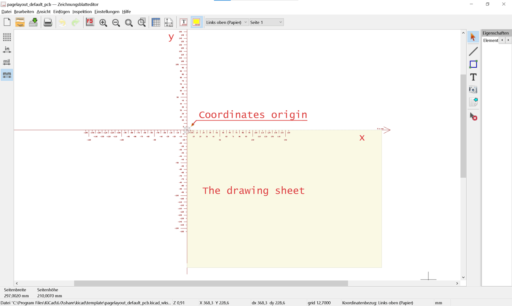
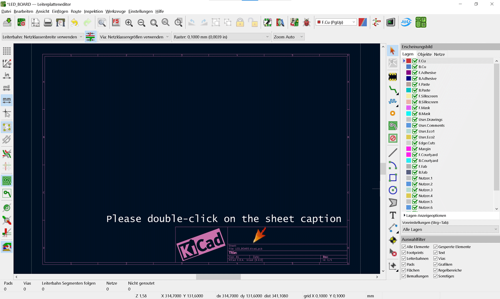
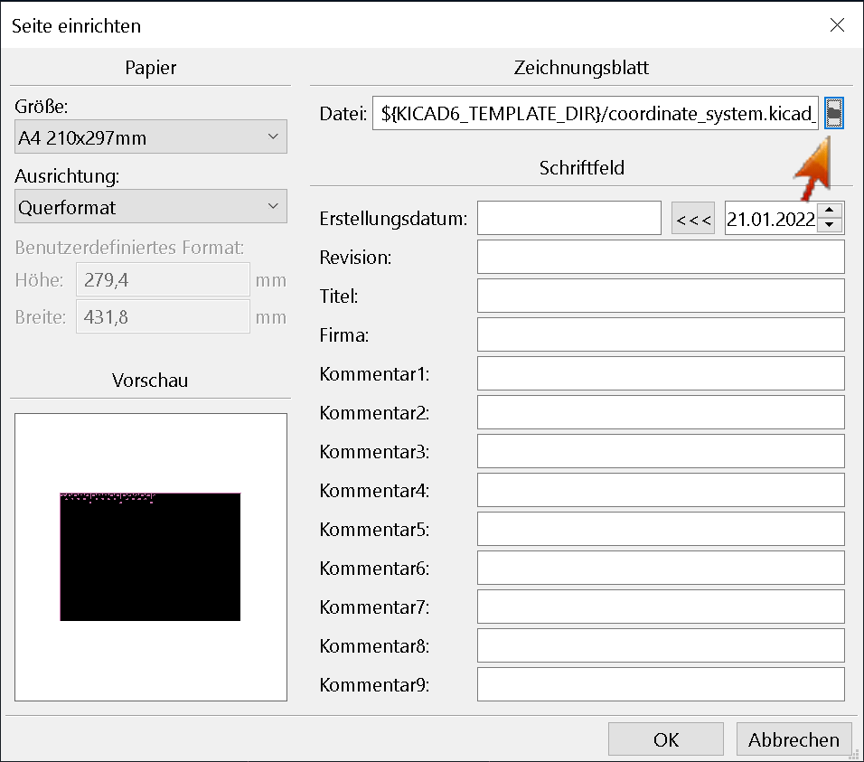
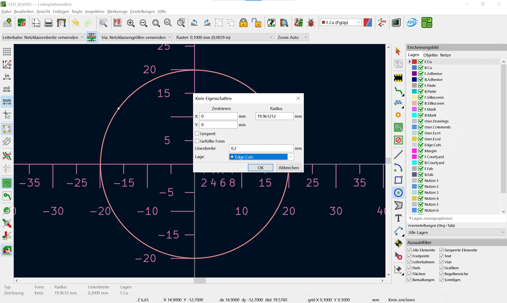
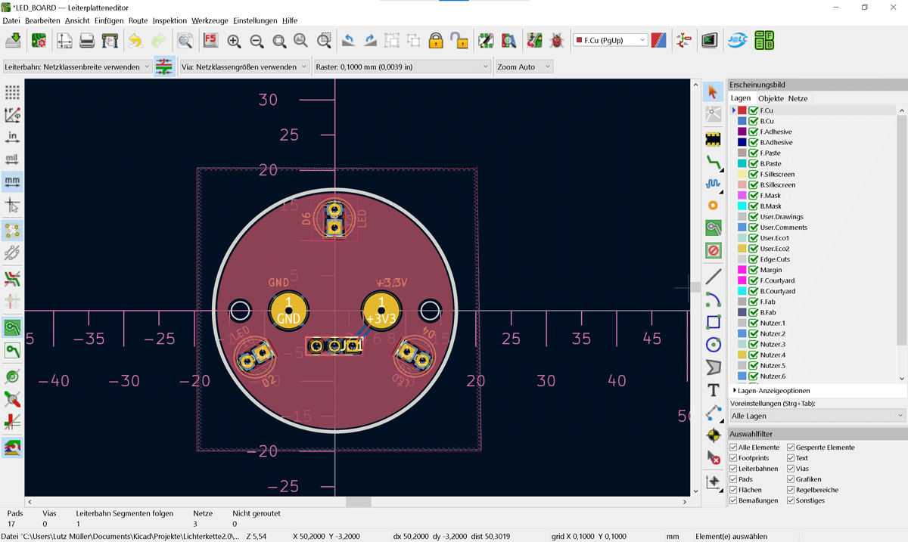

<h1>KiCad Page Template</h1>

<b>Collection of KiCad templates</b>

<dl>
  <dt></dt>
  <dd>The picture shows the finished coordinate system and the position on
the page template. Unfortunately, in KiCad 6 it is not yet possible to
place the coordinate origin in the middle of the worktop! Therefore
see the origin of the coordinates above, on the left, which is outside
the worksheet (yellow).
I have the file name once in English and once in German. This is the
same file.
  </dd>
  <!-- Other terms and descriptions -->
</dl>

<h2>Installation Guide</h2>
<ul>
<li>Install **KiCad 6.0**</li>
<li>Clone the file into your Templates folder.</li>
<li>Open KiCad -> 6.0 -> share -> kicad -> template</li>
<li>Add `.lkicad_wks` files to KiCad in the Global Templates page</li>
	<ul>
	     <li>`coordinate_system.kicad_wks`</li>
	     <li>`Koordinatensystem.kicad_wks`</li>
	</ul>
</ul>
<h3>Sources</h3>

<a href="coordinate_system.kicad_wks">English</a> or
<a href="Koordinatensystem.kicad_wks">Deutsch</a>

<h4>Description</h4>

<dl>
  <dt>Let's go</dt><dd>After installation, go to the PCB editor and double click on the
  worksheet frame. 
  </dd>
  <!-- Other terms and descriptions -->
</dl>
<dl>
  <dt>Next Step</dt><dd>Now the worksheet wizard opens and with one click, see red arrow,
  you can select the worksheet you just saved. 
  </dd>
  <!-- Other terms and descriptions -->
</dl>
<dl>
  <dt>Next Step</dt><dd>On the next picture you can see how I drew a circle from the
  center and declared this as the board boundary. 
  </dd>
  <!-- Other terms and descriptions -->
</dl>
<dl>
  <dt>Next Step</dt><dd>Finally, you will see the finished board. Now select everything
  and use the lock to lock the components. 
  </dd>
  <!-- Other terms and descriptions -->
</dl>
<dl>
  <dt>Next Step</dt><dd>You now have the option to reload your original worksheet as
  described above and fill in the label. Now mark the board again and
  move it to the middle of your worksheet. There is a query as to
  whether the locked elements should be moved. Click Ignore Ban. 
  </dd>
   Don't forget to save your project! <b>:)</b>
  <!-- Other terms and descriptions -->
</dl>

<h5>LICENSE</h5>

<a href="https://github.com/gabischatz/KiCad_Koordinatensystem/blob/4bcd966a9d43a1e3082f7a0f7d1b35422138fb5b/LICENSE">Please click</a>

